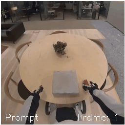
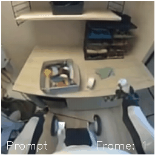

# Generating Humanoid Futures: Multimodal Joint Attention Between Past and Future for Action-Guided Video Prediction

Author: **Qasim Ali**  
License: **MIT License**  

---

## Overview

This repository contains the implementation of a world model for humanoid robots, designed to generate future video frames conditioned on past video frames, past actions, and future actions. The project is titled **"Generating Humanoid Futures: Multimodal Joint Attention Between Past and Future for Action-Guided Video Prediction"** and will be submitted to the Humanoid Workshop at CVPR 2025.

There are two variants to this model:
* Masked-HWM: A masked transformer generative model (similar to Genie 1). 
* Flow-HWM: A multimodal DiT architecture (similar to DiTAir) is a flow matching model. 
See their respective folder for how to run them.

The dataset used for training was provided by the **1xgpt contest**, and we extend our gratitude to 1xgpt for making this data available.

[Project Page](https://qasim-ali0.github.io/projects/humanoid_world_model/)
[Paper](https://arxiv.org/abs/2506.01182)

<p align="center">
  
  
</p>

---

## Installation

1. Clone the repository:
   ```bash
   git clone https://github.com/your-repo-url/humanoid_world_model.git
   cd humanoid_world_model
   ```

2. Create a new Conda environment:
   ```bash
   conda create -n humanoid_world_model python=3.8 -y
   conda activate humanoid_world_model
   ```

3. Install the required dependencies:
   ```bash
   pip install -r requirements.txt
   ```

4. Install the cosmos tokenizer from the [repo](https://github.com/NVIDIA/Cosmos-Tokenizer).

--- 
## Abstract 

> Humanoid robots, with their human-like form, are uniquely suited for interacting in environments built for people. However, enabling humanoids to reason, plan, and act in complex open-world settings remains a challenge. World models, models that predict the future outcome of a given action, can support these capabilities by serving as a dynamics model in long-horizon planning and generating synthetic data for policy learning. We introduce Humanoid World Models (HWM), a family of lightweight, open-source models that forecast future egocentric video conditioned on humanoid control tokens. We train two types of generative models, Masked Transformers and Flow-Matching, on 100 hours of humanoid demonstrations. Additionally, we explore architectural variants with different attention mechanisms and parameter-sharing strategies. Our parameter-sharing techniques reduce model size by 33-53% with minimal impact on performance or visual fidelity. HWMs are designed to be trained and deployed in practical academic and small-lab settings, such as 1-2 GPUs.


---

## License

This project is licensed under the **MIT License**. See the `LICENSE` file for more details.

---

## Acknowledgments

- Special thanks to **1xgpt** for providing the dataset used in this project.
- This work is inspired by advancements in image generation (e.g., Stable Diffusion 3) and adapted for video generation tasks.

--- 

Thank you for exploring this repository! If you have any questions or suggestions, feel free to reach out.
